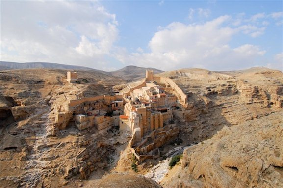

# 21/03 - Busca por Deus

## Salmos 63

Bom dia! Como vão vocês? 

Espero que bem, hoje vamos falar sobre buscar Deus e também um pouco sobre o conceito teológico de Livre Arbítrio.

> 1 Ó Deus, tu és o meu Deus; eu te busco ansiosamente. A minha alma tem sede de ti; meu corpo te almeja, como terra árida, exausta e sem água. 2 Assim, quero ver-te no santuário, para contemplar a tua força e a tua glória. 3 Porque a tua graça é melhor do que a vida; os meus lábios te louvam. - Salmos 63:1-3
> 

Livre arbítrio é a capacidade de **escolher entre diferentes caminhos**, sem ser forçado por Deus, destino ou qualquer poder externo. Acredita-se que Deus nos criou com essa liberdade, mesmo depois da Queda (pecado original). 

Podemos ver no nosso dia-a-dia pessoas confundindo o Livre Arbítrio com passe livre, **não é porque somos capazes de escolher o nosso caminho, é que conseguimos fazer com nossas mãos uma vida melhor**. Somos totalmente carentes da misericórdia de Deus e precisamos buscá-lo constantemente para não deixar nossa fé esfriar.

Lá no Éden Deus poderia ter feito Adão e Eva como criaturas com a única capacidade de adorar a Ele e nunca desobedecer, mas não, **Deus nos fez livres para amá-lo de forma sincera**, só sendo capaz de conscientemente escolher se abster da própria vida para adorar a Ele, é que se alcança o amor verdadeiro com Deus.

> 20 Eis que estou à porta e bato; se alguém ouvir a minha voz e abrir a porta, entrarei em sua casa e cearei com ele, e ele, comigo. - Apocalipse 3:20
> 

O Salmo se passa em um contexto de travessia de Davi no deserto de Judá, e Davi escrevia nesse ambiente:

É sobre esse tipo de amor que Davi fala no Salmo, um amor que necessita de contato constante com a graça de Deus e que precisa ser buscado todos os dias. Quando Davi diz: “Porque a tua graça é melhor do que a vida; os meus lábios te louvam.”, ele reconhece que **viver a graça de Deus é melhor do que viver o melhor desse mundo**. Vale a pena gastar tempo e energia buscando a Deus, não pelo ganho de recurso terreno, mas pelo presente que teremos no céu.

### Aplicações Práticas:

- Deus te deu capacidade para escolher seu próprio caminho, use seu tempo e energia finitos aqui na Terra para engrandecer o nome dEle;
- Deus não é mal-educado, Ele não vai te obrigar a amá-lo, o Espírito vai te mostrar aos poucos qual é o caminho para se aproximar mais dEle;
- Nos momentos em que os desertos (dificuldades da vida) não nos deixam escolher Deus, coloque tudo nas mãos dEle e espere o tempo dEle acontecer.

Tenham um ótimo dia!