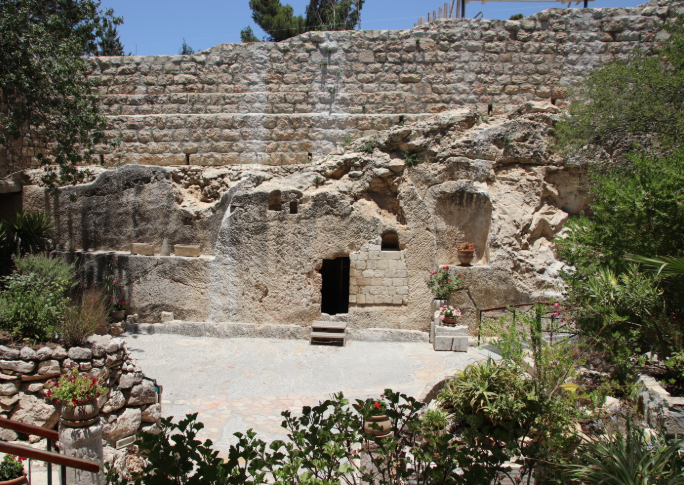

# 28/05 - Ele Ressuscitou

## Marcos 16:1-13

Bom dia! Como vão vocês? 

Espero que bem, hoje vamos falar da ressurreição.

> 1 Passado o sábado, Maria Madalena, Maria, mãe de Tiago, e Salomé compraram óleos aromáticos para ungir o corpo de Jesus. 2 E, bem cedo, no primeiro dia da semana, ao nascer do sol, foram ao túmulo. 3 Diziam umas às outras: — Quem nos removerá a pedra da entrada do túmulo? 4 E, olhando, viram que a pedra já estava removida. É que a pedra era muito grande. 5 Entrando no túmulo, viram um jovem sentado ao lado direito, vestido de branco, e ficaram atemorizadas. 6 Ele, porém, lhes disse: — Não tenham medo! Vocês procuram Jesus, o Nazareno, que foi crucificado; ele ressuscitou, não está aqui; vejam o lugar onde o tinham colocado. 7 Mas vão e digam aos discípulos dele e a Pedro que ele vai adiante de vocês para a Galileia; lá vocês o verão, como ele disse. 8 E, saindo elas, fugiram do sepulcro, porque estavam tomadas de temor e assombro. E não contaram nada a ninguém, porque estavam com medo. - Marcos 16:1-8
> 

Passaram-se 3 dias desde a morte de Jesus, e Sua morte ainda estava sendo motivo de tristeza, os discípulos (agora onze) e pessoas próximas estavam passando pelo luto e a dor de perder o seu Mestre. 

E as mulheres, Maria Madalena e Maria, a mãe de Tiago junto com Salomé se organizaram bem cedo pra cuidar do corpo de Jesus, até que no caminho surgiu a questão: “Como é que a gente vai tirar a pedra do túmulo?”, alguns túmulos da época eram buracos escavados e tampados apenas por pedras. Seria algo semelhante a isso:

Essa é uma tumba em Jerusalém que muitos acreditam ser a que Jesus esteve, não há um consenso entre especialistas para podermos ter certeza, mas o que vale aqui é a referência visual da tumba. E eles acharam a tumba exatamente assim, faltando uma pedra grande que normalmente tampava as tumbas da época. E como aconteceu?

Um jovem de branco explica a situação: “Não tenham medo! Vocês procuram Jesus, o Nazareno, que foi crucificado; ele ressuscitou, não está aqui; vejam o lugar onde o tinham colocado.”, gosto da forma direta que o jovem de branco fala as informações importantes logo de cara, em filmes é a hora do discurso e música épica, mas na vida real é só sendo direto e reto com as coisas de Deus.

> 9 [Havendo Jesus ressuscitado de manhã cedo no primeiro dia da semana, apareceu primeiro a Maria Madalena, da qual tinha expulsado sete demônios. 10 E, partindo ela, foi anunciá-lo àqueles que, tendo sido companheiros de Jesus, estavam tristes e choravam. 11 Estes, ouvindo que ele vivia e que tinha sido visto por ela, não acreditaram. 12 Depois disso, Jesus manifestou-se em outra forma a dois deles que estavam a caminho do campo. 13 E, indo, eles o anunciaram aos demais, mas também a estes dois eles não deram crédito. - Marcos 16:9-13
> 

Jesus aparece de novo, em carne e osso para se despedir e dar as últimas instruções aos discípulos. Ele não precisava se provar pra ninguém, mas por amor aos seus, apareceu para dar um adeus mais adequado. Ele aparece em algumas situações e sempre causando pânico, porque não é comum ver pessoas ressuscitando dos mortos. 

A Ressurreição é o maior dos milagres de Jesus, porque não é só um feito único, e impossível de ser replicado, mas é a forma mais pura do agir de Deus. Ele faz seu filho sofrer em nome dos pecados de todos, mas faz Ele voltar à vida. Há sempre uma segurança em Deus, Ele não age de forma displicente e inconstante igual a gente, seus planos, por mais impossíveis que pareçam, são perfeitos e se realizam sempre. 

### Aplicações Práticas:

- Sejam mais diretos e retos pra passar as informações das coisas de Deus pras outras pessoas, vai poupar muito tempo de ambos e é a forma mais adequada de se fazer as coisas pra Deus;
- Jesus não precisava se provar pra ninguém, mas por amor aos seus, apareceu para dar um adeus mais adequado;
- Há sempre uma segurança em Deus, por mais impossíveis que pareçam, são perfeitos e são maiores que os nossos que tendem a falhar e se perder no caminho. Então fique tranquilo se o plano ainda parece impossível, se é de Deus, a hora certa se realizar vai chegar.

Tenham um ótimo dia!